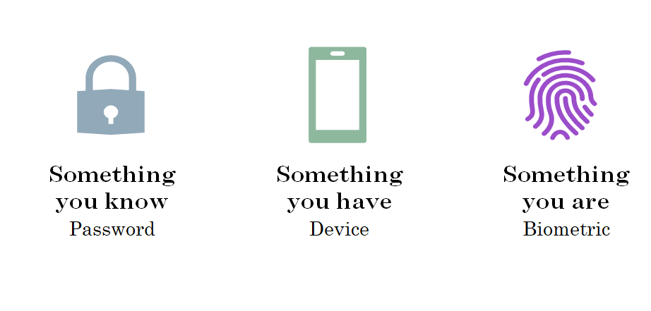
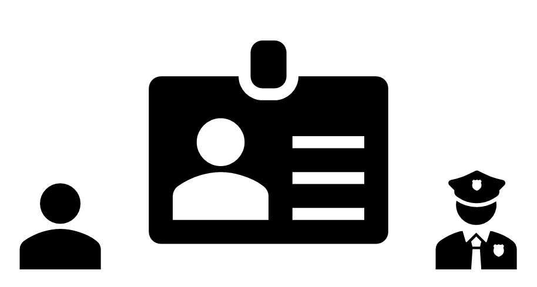
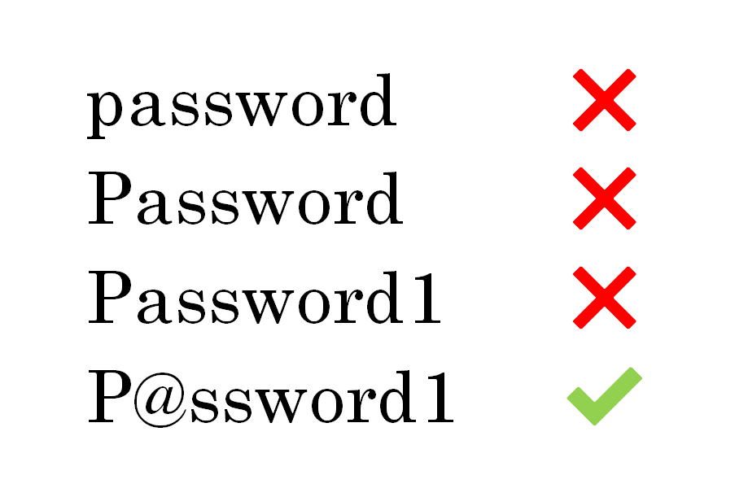
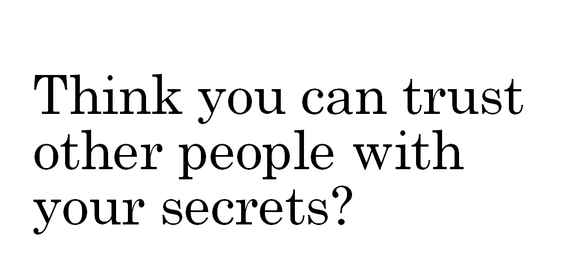
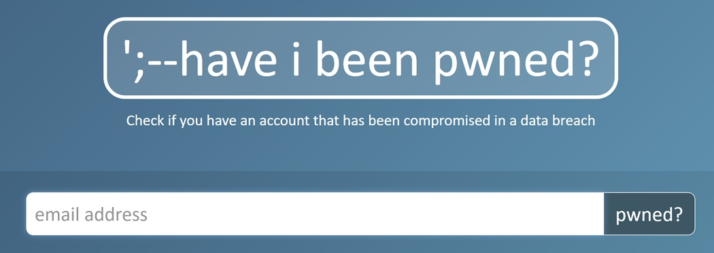

Passwords are hard.
Data breaches frequently expose poor security practices,
proving that, as an industry, we're not very good at this.
As developers have become more aware of these challenges,
we've tried to offload password management to "the big guns",
making our lives easier, but what about our users?
From confusing or ineffective password complexity restrictions
to password fields you can't paste into,
it's no wonder so many people find one password and stick with it.

The Web Authentication API (WebAuthn)
allows you to build passwordless authentication or two factor authentication
into your web applications seamlessly in the browser.
Using an asymmetric key pair where the public key is sent to a server,
and the private key stored securely on your device,
your secrets are never sent over the internet,
greatly reducing the risk of phishing attempts.

This post will provide an introduction to WebAuthn,
outlining the benefits, trade-offs, and future of this new authentication protocol.
Through a code demonstration,
you will see how to build an experience that puts control over their credentials (literally) back into the hands of your users.

---

<aside>
Prefer <a href="https://youtu.be/poJt8dZH9qE">watching (35 minutes)</a> to reading?

Or maybe you'd rather look at <a href="https://speakerdeck.com/bplowry/forget-your-passwords-with-the-web-authentication-api">slides and resources</a>?

<iframe width="560" height="315" src="https://www.youtube.com/embed/poJt8dZH9qE" frameborder="0" allow="accelerometer; autoplay; encrypted-media; gyroscope; picture-in-picture" allowfullscreen></iframe>
</aside>

---

👷 ‍️🚧 👷‍♂️
Please hold! I'll be updating this post over the next few days

---

## What is authentication?

Authentication is about proving your identity.
An authentication ceremony allows a user to prove that they are who they say they are.
In order to prove your identity, you will typically use
something you know,
something you have, or
something you are.



In web applications, authentication typically involves logging in to a system,
but authentication happens in real-world situations, too.
Imagine you are trying to get into a nightclub.
After waiting in line, you are asked by a bouncer to present your ID.



This exchange has serves a dual purpose:
firstly, they need to check your date of birth to figure out if you're old enough to enter -- that's _authorization_ --
but more importantly, they need to verify that it's _your_ date of birth they're checking -- _authentication_.

There are a few attributes of the card that allow it to be used as verification of your identity:

1. It's issued by a trusted source, which can be verified by making sure it has the right layout, colours, holograms, etc.
1. The photo looks like you
1. It has your name on it

<!-- <aside>
The bouncer checking that you are old enough is actually related not to authentication, but to authorization --
figuring out if you have permission to do or see something.
The bouncer may also consider things like whether you meet a dress code, if you're on a guest list, or that you're in a fit state to enter.
In web applications, authorization might decide what elements of a user interface you can see,
for example "⚙ Admin settings" would only be shown to admin users,
or you won't be able to browse/watch videos on Netflix if you haven't made a payment.
<aside> -->

## What's wrong with passwords?

People typically don't make good passwords.
Some of us might use password managers to help, but we're a small minority,
and even the most conscientious user has a few passwords outside of their password manager,
for example their OS user account, or the master password for their password manager.

Because we know people struggle to make strong passwords,
we add a whole lot of extra rules around them,
like password complexity rules
or forced password changes every 90 days.
These rules can give the appearance of a stronger password,
or less risk when a password is compromised.
Whether that is true depends on how you use them.

Users can meet complexity requirements by adding numbers or changing letters to symbols,
but complexity rules alone don't make a good password.



Password complexity rules can provide a false sense of security,
since so many of us simply add numbers onto the end or make common substitutions of letters for symbols.
The idea that a complex password is better doesn't hold up when so many passwords follow similar patterns.

A password is intended to be something that is only known by the user,
and can be verified by the service where they use it.
It shouldn't be stored on either side in a way that someone else could decipher it.
For users, that usually means not writing it down in a notebook titled "Passwords",
and for application developers, that means not storing it in plain text.
The password is a shared secret.



If you trust your friends, but you wouldn't give them your bank account password,
you're probably not OK with someone you don't trust getting your passwords.
If your password has been compromised, you may get some warning,
for example a bank may require verification of any unusual activity (e.g. large transfers to an attacker's bank account).
Other times, we only know when large dumps of passwords end up on the internet, at sites like

<a href="https://haveibeenpwned.com/" target="_blank" rel="noopener">
  
</a>

Even if none of your accounts or passwords have been contained in a published breach,
attackers still have ways to get them from you.
Many people have had their passwords stolen by phishing websites
-- websites that are designed to look like legitimate websites with the hope that you'll enter your login information into them.
Sometimes, they'll find a list of common passwords and try them with a number of accounts.

Ultimately, [your password isn't the problem](https://techcommunity.microsoft.com/t5/Azure-Active-Directory-Identity/Your-Pa-word-doesn-t-matter/ba-p/731984), nor is how they are stored. The biggest problem with passwords is not how we deal with passwords, but that we have them at all.

## What is WebAuthn?

WebAuthn is a specification in the <abbr title="World Wide Web Consortium">W3C</abbr>.
The primary contributors are Mozilla, Microsoft, Google, FIDO Alliance and the W3C.

It defines a standard by which browsers can get assertions from authenticators,
and how web servers can validate those assertions.
It also defines a JavaScript API for web applications to request credentials from the browser.

The Web Authentication API, combined with the Client-to-Authenticator Protocol (CTAP),
make up the FIDO2 protocol.

## How does it work?

Using a device called an authenticator

- a separate device, known as an external, cross-platform or roaming authenticator
- built in to a phone or laptop, known as an internal, platform or bound authenticator

What gets sent around

- for registering credentials:
- website information
- for getting credentials
- website information

You may have noticed that we never send anything secret.

 

The authenticator can store credential information for each login you'd like to use

- website identifier
- user identifier
- credential identifier

<span role="img" alt="This section is being worked on">🚧 DETOUR ➡</span>

<!-- Some authenticators store the _actual_ private key for the credential source,
in this case they are referred to as **resident keys**, because they are resident on the authenticator.
Authenticators that support resident keys can only store a limited number -- because they have to physically store something, and storage is limited. The Yubikey 5C, for example, can store 25 resident keys.

Authenticators can hold an unlimited number of **non-resident keys** -- because nothing is stored on the device.
That might sound strange, but this actually works by encrypting the _credential_ private key using the private key baked in to the _device_ during manufacturing, and sending that to the client (browser, app, etc) as the credential ID.
That means when the application requests an assertion for any particular credential ID, the authenticator first has to decrypt the credential ID to get the private key, so that it can sign the authenticatorData.
As a consequence, non-resident keys cannot be used for usernameless scenarios, which we'll go into a bit further later on. -->

## Can I use it?

In a word, yes. Read on if you want more detail 😆

<a href="http://caniuse.com">Can I Use</a> allows you to import data from your country,
and also has a "usage relative" option, which can help narrow down to your targeted users,
or you can import actual data for your users from Google Analytics.

<script src="https://cdn.jsdelivr.net/gh/ireade/caniuse-embed/caniuse-embed.min.js"></script>
<p class="ciu_embed" data-feature="webauthn" data-periods="future_1,current,past_1" data-accessible-colours="false">
  <a href="http://caniuse.com/#feat=webauthn">
    <picture>
      <source type="image/webp" srcset="https://res.cloudinary.com/ireaderinokun/image/upload/v1569250922/caniuse-embed/webauthn-2019-9-23.webp">
      <source type="image/png" srcset="https://res.cloudinary.com/ireaderinokun/image/upload/v1569250922/caniuse-embed/webauthn-2019-9-23.png">
      <source type="image/jpeg" srcset="https://res.cloudinary.com/ireaderinokun/image/upload/v1569250922/caniuse-embed/webauthn-2019-9-23.jpg">
      
    </picture>
  </a>
</p>

At time of writing, it is supported in Chrome, Firefox, Edge and Safari (macOS),
and not supported on Safari (or any other browser) on iOS.
Whether someone can actually use it depends on
if they have an external authenticator
or if their phone/computer can act as an authenticator.

I don't have numbers, but I'm going to guess that a very small minority own authenticator devices like a Yubikey.

It's more likely that someone will have a phone/computer that is capable:

- ✅ Android phone from Android 7 and above ([~58% of Android phones](https://developer.android.com/about/dashboards?hl=en))
- ✅ Windows 10 device capable of Windows Hello -- <span role="img" alt="Note">ℹ</span> some devices are capable of using Windows Hello with a PIN, so you may not need a computer with a fingerprint scanner or an infra-red camera.
- ✅ macOS device with Face ID or Touch ID
- ❌ unfortunately, it's not supported on iOS yet.

The lack of support on some devices doesn't need to hold you back, though. You can detect support in the browser and provide different experiences for users on devices without those capabilities, without taking anything away.

## How do I use the JavaScript API?

The JavaScript API only has a few methods.

```js
// feature detection for WebAuthn
window.PublicKeyCredential

// detection for platform/on-device authenticator
await window.PublicKeyCredential.isUserVerifyingPlatformAuthenticatorAvailable()

// registration of authenticator
await window.navigator.credentials.create(options)

// authenticate with authenticator
await window.navigator.credentials.get(options)
```

If you're wondering about those `options` parameters,
<a href="https://webauthn.guide/">webauthn.guide by Duo</a> does a much better job explaining them than I would.

## How can WebAuthn be better for users?

🚫🔑

## Resources

**Specification**

- Level 1 – W3C Recommendation https://www.w3.org/TR/webauthn/
- Level 2 – Working Draft https://w3c.github.io/webauthn/

Demos

- https://webauthn.io/
- https://webauthn.me/debugger
- https://www.passwordless.dev
- https://webauthntest.azurewebsites.net/

Guides

- https://developer.mozilla.org/en-US/docs/Web/API/Web_Authentication_API
- https://webauthn.guide/

Workshops

- https://fidoalliance.org/developer-tutorial-getting-started-with-webauthn/
- https://codelabs.developers.google.com/codelabs/webauthn-reauth/#0

Libraries

- .NET https://github.com/abergs/fido2-net-lib
- Node.js https://github.com/apowers313/fido2-lib
- Various https://developers.yubico.com/Software_Projects/FIDO2/

More links

- https://github.com/herrjemand/awesome-webauthn
