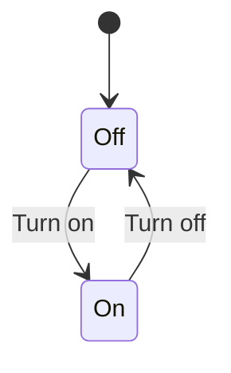

# What is a finite state machine

A finite state machine (or FSM) is a way to
model a system with a finite number of states and transitions between those states.
They come with several benefits including: preventing invalid states by ignoring invalid events.

FSMs can be represented in different ways, but the one most people are probably familiar with is as a diagram with boxes for the states, and directional arrows for the transitions between them.

We'll use a simple example of a light switch to demonstrate a few ways of representing FSMs below:


A table with states and actions on either axis, and resulting state in the cell.

| State 👇 / Action 👉 | Turn on | Turn off |
| -------------------- | ------- | -------- |
| On                   | -       | Off      |
| Off                  | On      | -        |

You can make charts in markdown with [mermaid](https://mermaid-js.github.io/mermaid/#/stateDiagram) ([open in the live editor](https://mermaid-js.github.io/mermaid-live-editor/beta/edit#eyJjb2RlIjoic3RhdGVEaWFncmFtLXYyXG4gICAgWypdIC0tPiBPZmZcbiAgICBPZmYgLS0-IE9uIDogVHVybiBvblxuICAgIE9uIC0tPiBPZmYgOiBUdXJuIG9mZiIsIm1lcm1haWQiOiJ7XG4gIFwidGhlbWVcIjogXCJkZWZhdWx0XCJcbn0iLCJ1cGRhdGVFZGl0b3IiOmZhbHNlLCJhdXRvU3luYyI6dHJ1ZSwidXBkYXRlRGlhZ3JhbSI6ZmFsc2V9))



Or use a DSL like [Lucy](https://lucylang.org/), which compiles to [XState](https://xstate.js.org/docs/)

```lucy
state on {
  turn_off => off
}

initial state off {
  turn_on => on
}
```

Or [SCXML](https://www.w3.org/TR/scxml/), an open standard for Statecharts (similar to FSMs, but with more functionality)

```xml
<?xml version="1.0"?>
<scxml xmlns="http://www.w3.org/2005/07/scxml"
       version="1.0"
       initial="off">

  <state id="off">
    <transition event="turn_on" target="on"/>
  </state>

  <state id="on">
    <transition event="turn_off" target="off"/>
  </state>

</scxml>
```

# In the design stage

FSMs help you model system behaviours as the user will use them.
They're a great match for user interfaces.
Each "screen" represents a finite state (because there are a finite number of them),
and each button press or link is an event or transition.

UX designers have been using FSMs for years, though they may not call them that.
Mapping out user flows with a view of the screen and then an arrow to the new state (or states) based on a user action is pretty much the same as the boxes and lines suggested above.

These visual representations make it easier to communicate with wide groups
-- a diagram is more accessible than code --
and means that more people can give feedback or point out errors in our design.

# In the build stage

While the examples above mostly refer to user interfaces,
they can also be used to model data flows in your domain.
For example, the image below shows potential business process for an 'order'.
Some invalid states are prevented by this design
-- an order cannot be cancelled once it has shipped,
nor can it be refunded before it has been paid.


# In the testing stage

By looking at a transition in isolation, we have:

- an initial state
- a user action
- a final state

If you're familiar with Behaviour-Driven Design (BDD), that's analogous to a Given-When-Then.

That is a good starting point for a unit test.
If you want to move up the
<a href="https://kentcdodds.com/blog/the-testing-trophy-and-testing-classifications" target="_blank" rel="noreferrer noopener">testing trophy</a>,
you can make integration or end-to-end tests if you involve more of the machine.

In an upcoming post, I'll demonstrate how finite state machines can be used to generate test cases
