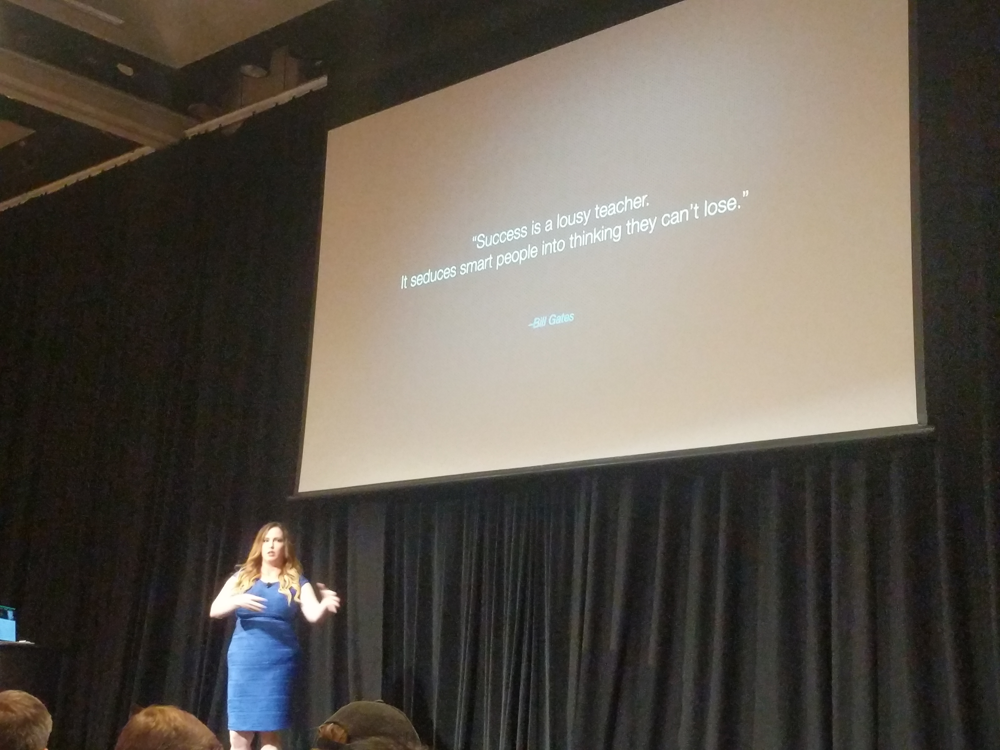
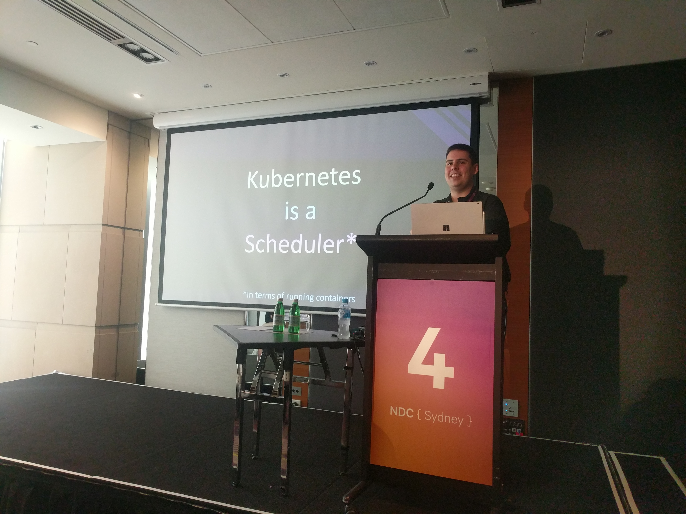
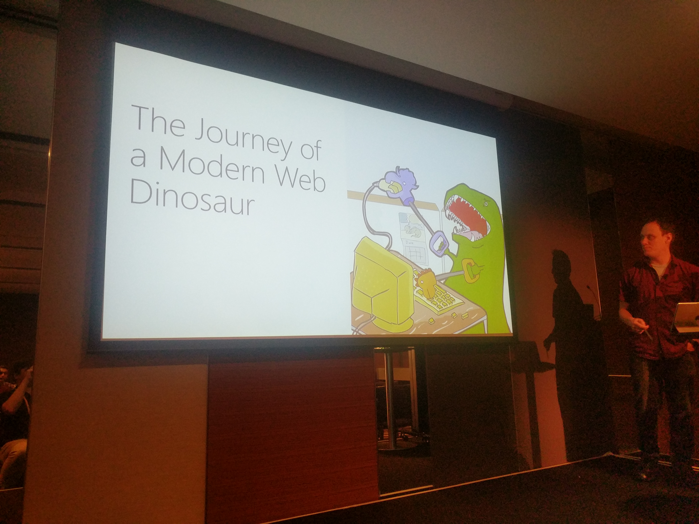
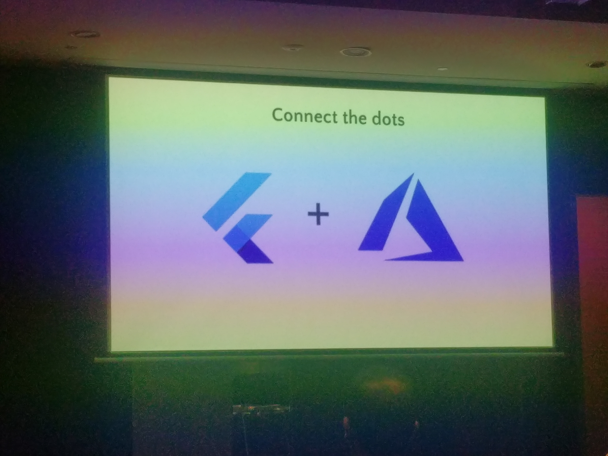
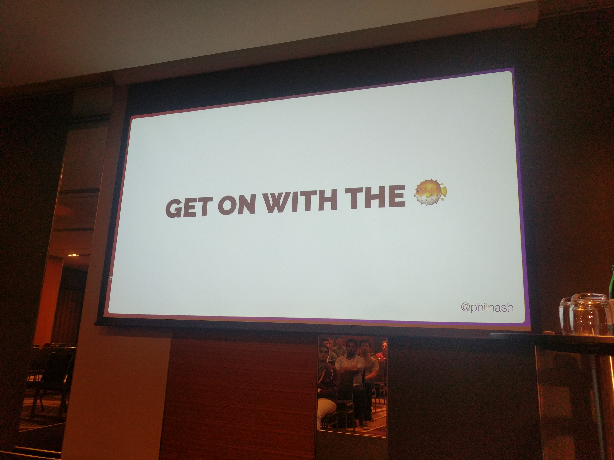
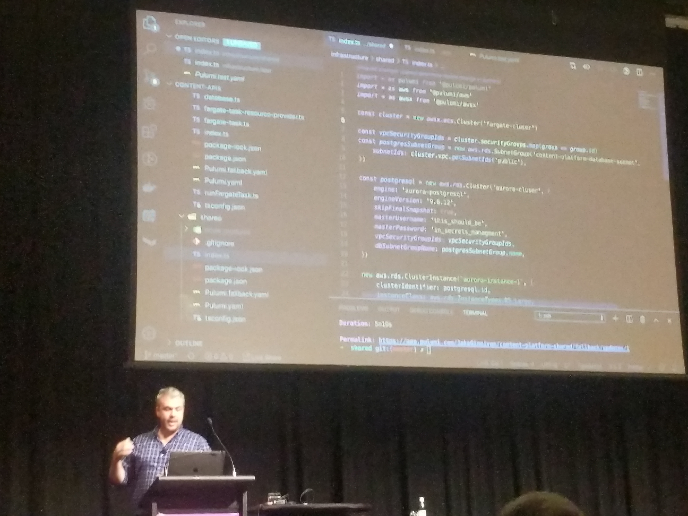
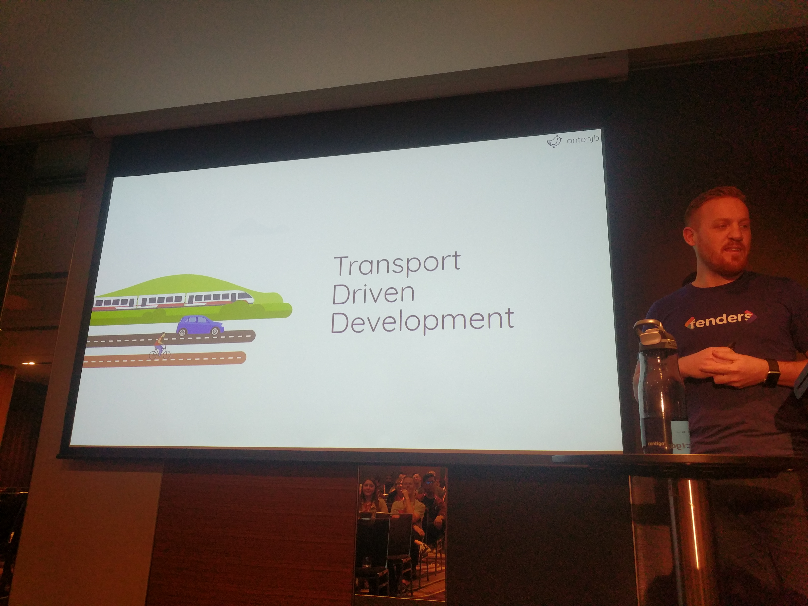

I went to NDC Sydney for the first time, this year.
I took notes for most of the talks I attended, and thought I should share.

<nav>

- [The care and feeding of software developers](#the-care-and-feeding-of-software-developers) by Heather Downing

- [Kubernetes 0 to 100](#kubernetes-0-to-100) by Scott Holden

- [Modern JavaScript for web dinosaurs](#modern-javascript-for-web-dinosaurs) by Scott Holden

- [Am I a good developer?](#am-i-a-good-developer) by Emad Alashi

- [Have lunch and impact on your company!](#have-lunch-and-impact-on-your-company) by Nelly Sattari

- [Chinafy your apps + Lessons you can steal from China](#chinafy-your-apps) by Adam Cogan

- [Using Flutter to develop cloud enabled mobile applications](#using-flutter-to-develop-cloud-enabled-mobile-applications) by Nick Randolph and Pooja Bhaumik

- [What's going on with Project Fugu?](#whats-going-on-with-project-fugu) by Phil Nash

- [How to do in-app chaos testing](#how-to-do-in-app-chaos-testing) by Wesley Cabus

- [Bank Grade Security](#bank-grade-security) by Kieran Jacobsen

- [Beyond infrastructure as code DSLs](#beyond-infrastructure-as-code-dsls) by Jake Ginnivan

- [Thousands of concurrent connections with Azure SignalR Service](#thousands-of-concurrent-connections-with-azure-signalr-service) by Nelly Sattari and Stafford Williams

- [CSS Grid - What is this magic?!](#css-grid-what-is-this-magic) by Amy Kapernick

- [Commuting like a developer](#commuting-like-a-developer) by Anton Ball

</nav>

---

##  The care and feeding of software developers

Heather Downing [@quorralyne](https://twitter.com/@quorralyne)

The best leaders aren't "the best at tech"

Get away from what makes people like you (similar interests, background, etc.)
Go out of your way to find the people unlike you. Equal attention.

Leadership is a muscle, you need to exercise it.
Don't get comfortable.
You need to sacrifice for your team.

What developers want from leaders:

- safety (failure, support, belief)
- flexible and empathetic during personal challenges
- listen. They speak first
- respect. Differences
- encourage - "you got this"
- recognise - talk to them about their progress. Acknowledge their achievements, but also recognise their effort
- empower - let other people demonstrate their capability. Let them grow. Help them grow

Our differences make us a better team. People are not drop in and replace

You may need to support people at different levels.
Juniors need freedom to learn, make mistakes, and grow.
Mid-level need freedom to pair, share their knowledge, learn, make mistakes, and grow.
Seniors need freedom to experiment, try new ideas, pair, share, learn, make mistakes, and grow.
Noticing the pattern yet?

Your team will also have different personality types, and this may change as time goes by.
Optimists will help keep morale up -- "Everything is on fire, but hey, we're alive".
Pessimists will make sure we're not getting ahead of ourselves.
You probably need people who are bold, and visionary.
Sometimes people will be down-hearted; it's not going to be all the time, but it'll be _all_ of us, _some_ of the time.

How do you become the best leader?
Let them do their jobs?
Handle all the non-dev stuff for them.
Be mostly responsive and reachable.
Have regular (frequent and predictable) one-on-ones.
Value quality over quantity or velocity; let them do the best job they can.
Avoid task switching, if you can. Changing context from day-to-day,
or multiple times per day isn't always productive and can be overwhelming.
Be the shield.

You may need to be vulnerable:
Be prepared to give away control.
Emphasise that you're learning, too.
Let them fail and learn.
Remember that it's OK to not know.

The challenge?
Learn new tech, see how you can apply it.
You know, that's cool. But also
learn about leadership, because that's your future.
Whether you end up as team lead or senior dev:
leadership is part of your job.

[Back to top](#)

---

##  Kubernetes 0 to 100

Scott Holden [@sc_holden](https://twitter.com/@sc_holden)

To understand Kubernetes, you need to understand containers.

`container = code + runtime`

The main benefits of containerisation are in resource isolation.
Compared to a VM,
there's no OS -- and the OS is huge --
so you don't need to "carry" it around.

All the bits of containers have been around forever.
Docker put it all together and made it easy.

<aside>**HOT TIP:** `docker run -d **--rm**` will clean up afterwards.</aside>

If you have multiple containers,
layers are shared, so we only have one copy of dependencies.

Scott went through an example of
creating a new image from an existing one "by hand".
That is, by opening a remote terminal with `docker exec bash`
and going to town, then publishing the new image.
But that's not the recommended approach.

Usually, you'd use a Dockerfile.
`FROM` is like starting the image.
`RUN` is the same as jumping in and editing.

Docker Desktop ships with Kubernetes.
You can turn it on and go.

Kubernetes is about container orchestration.
That includes:

- scheduling
- monitoring
- scaling
- deploying new versions
- configuration, and
- service discovery

Kubernetes talks to the container runtime.
It's not a container runtime itself.

In order to manage your schedule your containers, Kubernetes needs master nodes and worker nodes.

The master node

- is probably actually a cluster of master nodes
- runs Kubernetes

Worker nodes

- some form of "compute"
- runs workloads
- container runtime lives here

A typical configuration might start with 3 master nodes and 5 worker nodes.

Kubernetes exists somewhere between
IaaS (Infrastructure as a Service) and
PaaS (Platform as a Service).
It depends where you sit.
(Self: doesn't that mean it's _both_?)

Managed Kubernetes service (e.g. Azure Kubernetes Service ... Google, AWS, Alicloud likely have equivalents)
can manage most of the infrastructure details.
You don't need to think about master nodes, you just need to configure them.

Next up was a look through the _nuts and bolts_ of k8s.

Pod (one or more containers)

- Single instance of the smallest component
- multi container - use for logging, monitoring, service mesh
- the pod is what scales. It all scales together
- by itself, is not resilient
- `kubectl apply` to create. `kubectl delete` to delete a pod

ReplicaSet

- ensures you anyways have N pods running

Deployment

- deploying a new version of a ReplicaSet
- it will spin up and spin down the new and old versions
- used if you want to update things
- failback is also available

Service

- lets you load balance in cloud, expose a port per node, etc.

Ingress

- expose HTTP endpoints for different services

**Extras:**
Autoscaling: but not for free, you'll need to configure it

Namespaces: provide logical separation, e.g. dev and test

Resource quotas

AKS (Azure Kubernetes Service) - free control plane - don't pay for the VMs, don't manage them, apart from some config

<aside> **HOT TIP:** Use specific versions of dependencies so it spins up from cache. The `:latest` tag will always fetch from the registry, leading to slower startup.</aside>

I'd come in to this talk with a view that I'd never need Kubernetes.
My main takeaway was that Kubernetes doesn't mean you need huge complicated systems:
Restarting a single killed pod with a ReplicaSet is a useful feature.

[Back to top](#)

---

##  Modern JavaScript for web dinosaurs

Ryan Preece [@Preecington](https://twitter.com/@Preecington)

Web development has changed a lot in the past few years.

When Ryan last touched web development, jQuery was king. You'd download the file and put it on the web server with FTP. Simple.

Now we have

- CLIs (command line interfaces),
- transpilers,
- packages and package managers,
- bundlers,
- NodeJS.

It's a lot more complicated.

The steps along the way:

- `<script src="scripts/jQuery.js" />`
  We added a reference to the file we'd downloaded and put on the web server
- <code class="language-text" style="word-break: break-all;">
    &lt;script src="node_modules/jQuery/dist/jQuery.min.js" /&gt;
  </code>
  We could install dependencies with NPM
- `require("jQuery")`
  CommonJS came around and we could install dependencies using `require`
- 2011: The first bundlers started appearing. Browserify was the main player.
- 2015: Webpack comes along and quickly becomes the go-to (self: typical JavaScript)

Transpiling allows us to use syntax that isn't supported in older browsers, e.g. turning `async/await` code into `.then` and `.catch`.

Polyfills allow us to use functionality that isn't natively supported in older browsers, e.g. ensuring that `Promise` is available in the browser.

Together, these allow us to write "modern" code, so we don't need to worry (as much) about browser differences.

Script runners make all those CLI commands easier.
First Grunt and Gulp, then NPM added `scripts`, and it's become the standard.
The script runner lets you run `npm run build` rather than `./node_modules/bin/webpack webpack.config.js --production` or something else complicated.

React, Vue, and Angular (the most-used web frameworks at time of writing) use all of these things under the hood.
They have CLI tools to create new projects following best practices.

[Back to top](#)

---

##  Am I a Good Developer?

Emad Alashi [@EmadAshi](https://twitter.com/@EmadAshi)

Are you a good developer
We should understand one level below what we're working on

- in a human pyramid, you don't care about the bottom, only the layer you're standing on

Appetite to learn

[Back to top](#)

---

##  Have lunch and impact on your company!

Nelly Sattari [@nelly_sattari](https://twitter.com/@nelly_sattari)

Brown bags or lunch and learn. Takes the name from the brown paper bag you might take your lunch in.

Benefits:

- Build a network to find speakers
- Great way to network
- Attend other events
- Companies/vendors might want to get involved
- Good way to build
- your profile
- learning culture in org
- relationships with other areas of your company

If you're going to run brown bags, make them regular.
Having one now and another one later, maybe, doesn't really work.
People need to know what to expect and when to expect it.
It might start slowly, but if you stick with it you can build something good

Nelly went from ~20% attendance to ~80% within a year, and now her company even provides lunch!

Organising them might seem like a lot of effort,
but it's probably not as much as you think.
Maybe a few hours a month (depending on how often you have them).

People will appreciate you making the effort,
and they'll make an effort, too (to attend, speak, organise, etc.)

[Back to top](#)

---

##  Chinafy your apps + Lessons you can steal from China

Adam Cogan [@AdamCogan](https://twitter.com/@AdamCogan)

China is a rapidly changing environment.
If you went to China in 2015, there's a good chance it's a different place now.

China is projected to become the world's largest economy soon (2029), overtaking the USA.

Many companies have \$0 revenue in China, even big ones.
This is partly due to the Great Firewall of China.
But it's also because we don't understand the culture.

Internet usage is mostly mobile (65% if I remember correctly, compared to 40% in Aus?).
People primarily use native apps, over web apps.
There are also pseudo-apps like WeChat official pages and mini-apps.

Payments are typically done using WeChat Pay or AliPay over credit card or cash.
Shop keeper will scan a QR code on your phone to make payment.
Even people asking for money on the street have WeChat QR codes.

There's a thing called Sesame credit
(self: I think this is that social credit system).
You are judged and ranked on your activity;
things like whether you pay your bills on time,
but maybe other stuff, too,
like the rankings of your friends?

Sesame credit is endorsed by AliPay, WeChat Pay, People's Bank of China, etc.
You can get better interest rates, or no deposit for hire bikes, which is nice.
But you can also end up having travel restrictions ... not so nice.

How to succeed in China:

- use WeChat official pages/mini-apps
- payments using AliPay, WeChat pay
- authentication using phone number and OTP (one-time passwcode) or social login. Not username/password
- QR codes everywhere.
- gamify interactions with your apps. e.g. "red envelope" (traditional) for a random win
- have a Chinese name
- use a Chinese cloud provider
- find local partners sales and support
- translation/localisation by a local
- user experience: don't use minimalist design. The busier, the better. There was an example of a video with comments appearing over the top, to the point you can't see the video.

[Back to top](#)

---

##  Using Flutter to develop cloud enabled mobile applications

Nick Randolph [@thenickrandolph](https://twitter.com/@thenickrandolph)
and Pooja Bhaumik [@pblead26](https://twitter.com/@pblead26)

Flutter does differential rendering (like React).
Doesn't use native components,
but uses the Skia rendering engine to draw everything.
This helps you build apps that look the same on Android and iOS
(some minor quirks, like over-scroll behaviour).

You still need to consider if that's right for you ...
after all you may want to be consistent with the platform.

Easy to use with Material Design (Android) or Cupertino (iOS) - components are available and they _look_ like native.

Everything is a widget, and it's all declarative.

The developer experience can be a lot better than native.
For example, hot reloading is way better than Xamarin or native Android and gradle.

Consider Visual Studio App Center for building and publishing into the app stores.

[Back to top](#)

---

##  What's going on with Project Fugu?

Phil Nash [@philnash](https://twitter.com/@philnash)

Project Fugu is run by the Chrome team.
The goal is to push the web forward, towards parity with native apps.

Previously we had vendor prefixes, like `ms-flex`, or `-webkit-line-clamp`.
Now we have feature flags.

You can enable them yourself by going to `chrome://flags` and `#enable-experimental-web-platform-features`.
But that doesn't really work if you want to put something on your public website.
Users won't enable feature flags to view your website.

So Chrome has this thing called Origin Trials.
Websites can request to join an origin trial,
which means you don't need users to opt in --
Chrome will enable whatever flags you asked for when users access your site.

They might also take it away without telling you,
so you need to make sure it works _without_ the flag.
You'd probably need that anyway to support other browsers, so no big deal.
The reasons they'd take it away:

- too many people using it -- it's meant to be an experiment
- the experiment has expired
- other reasons?

**The new stuff:**

Generally the new features require `https`,
and often users will need to give permission
(for camera, location, file system, push notifications, etc.)

**Web share API**
No tracking. No JS, don't need to (and can't) track where they shared it or what platforms they use

**Web share target API**
Make your own PWA (progressive web application) as a sharing target?
Chrome origin trial suggested it was ok, trying to convince Safari

**Wake lock**
Keeps the screen awake (or system, but it doesn't work yet)
Useful for non interactive sites, or sites that don't interact with button/links (e.g. motion)

**Aborting requests**
`AbortController` to cancel fetches, by passing in `controller.signal` into the `fetch`.
Aborting is not supported for all promises, but some APIs (particularly new ones) do support it.
(self: this also applies to WebAuthn methods)

**Contacts picker API**
Could be useful for calling, emailing, sharing with contacts.
The user selects from contacts on their device.

**Native file system API**
`window.chooseFileSystemEntries()` returns a promise.
This was added as an alternative to the older alternatives.
Drag and drop files don't work on mobile.
The "Choose file" button is ugly.
This API gives access to the file system (with permission from the user).

**Shape detection API**
Face detector, Text detector, Barcode detector
No mouth = no face, apparently
Get locations of different features and bounding box.

Takeaway: It's all good for them to build it, but if we don't experiment, they won't find the edge cases or be able to make it better

[Back to top](#)

---

##  How to do in-app chaos testing

Wesley Cabus [@WesleyCabus](https://twitter.com/@WesleyCabus)

Wesley was making software that would be deployed on a server in a suitcase in Rwanda.
They go hours/days without internet because of power outages.
Wesley's team were developing in an office with WiFi.
They're nothing alike.

They wanted to simulate more realistic conditions for how the software was actually used.
Unfortunately, airplane mode isn't an accurate simulation.

Wesley wrote a library called ruh roh [on NuGet](https://www.nuget.org/packages/RuhRoh/).
This lets you wrap services or methods in your app startup, and "inject some randomness".

You can:

- slow down
- throw exceptions
- change responses

Based on:

- random failures
- every N calls,
- after N calls,
- inputs to the method

It lets you test what happens when stuff doesn't work.
This is really useful for external dependencies.
You're more likely to already handle errors in your own code,
but assume that a library you didn't write behaves in a way it might not.

[Back to top](#)

---

##  Bank Grade Security

Kieran Jacobsen [@kjacobsen](https://twitter.com/@kjacobsen)

Kieran went through a number of tests (and showed us how to do them) for Australian banks.

Things the banks didn't always do well:

HSTS (HTTP Strict Transport Security) helps prevent MITM (person in the middle) attacks.
It works by telling the browser to never display the page
if the certificate isn't the same as the first time you visited.
That still leaves a small chance for an attacker (the first time you go to the page),
so there's a thing called HSTS pre-loading.
Preloading lets browsers pre-load the right certificates, so it removes that chance for the attacker.

Having a CSP (Content Security Policy) prevents the browser from loading resources from un-approved sites.
Essentially, you whitelist known sources, e.g. analytics or third parties you _expect_ to appear.
Any other requests will be rejected, so if a malicious script tries to send or download something, it will fail.
There's a "report only" mode that can be used to tell you what resources you _are_ getting,
in case you're not ready to completely block that traffic.

TLS is great, but TLS 1.0 is not. It has known vulnerabilities -- not surprising, given it's 20 years old.
Some websites still support it because "we have users using IE6 on Windows XP".
The problem is, when a website supports TLS 1.0, or 1.1, it puts everyone at risk for the sake of a few.
TLS 1.2 or 1.3 for the win!

When well-meaning people want to report issues to a bank (or anyone),
it's often difficult to find the right person to contact.
Posting in open channels like Twitter can also alert attackers that there is a problem they can exploit,
or give them notice so they can clean up their tracks.
To help reduce the problem, it is recommended to put information in `/.well-known/security.txt`.
The information in this document should outline the process for reporting an issue.
You should include:

- who to contact
- relevant policies
- how to send the report (e.g. public keys for encrypting the message)

For easy message encryption, you can use [keybase.io](https://keybase.io)

Resources:

- [Security Headers](https://securityheaders.com/)
- [Report URI](https://report-uri.com/)
- [SSL Labs](https://www.ssllabs.com/)

[Back to top](#)

---

##  Beyond infrastructure as code DSLs

Jake Ginnivan [@JakeGinnivan](https://twitter.com/@JakeGinnivan)

Pulumi allows you to define resources in code, using TypeScript, python, or Go.

Configuration in code has a few benefits. You can test it, you can use feature flags, you can access environment variables, you can create resources based on conditions.

Pulumi has a CLI. It's not entirely standalone, as it needs to track some state.
That state relates to what's actually deployed - there's some extra metadata stored by Pulumi, so it can't just query AWS/Azure to find what's there.

app.pulumi.com is managed service with "enterprise" features like audit, policies, secret management.
You can get by without it if you don't want to pay

Pulumi can publish and consume infrastructure -- that is, create new stuff and reference old stuff.

You can mix infrastructure code with application code.
For example, create an S3 bucket and an `onCreated` event handler.
The event handler will end up in a Lambda with a S3 trigger.
That's pretty cool.

Jake's team are going down this path because "we want devs to manage infrastructure".
They have an ops team who will give input, provide advice, make sure it's all monitored, etc.
This will allow knowledge sharing between dev and ops,
build awareness of what's actually running your code and how it fits together.
They also hope it will allow them to evolve their architecture.
In the future, they'd like to simplify if possible, and reduce cost.

Pulumi crosswalk (x-walk? the plugins are things like `awsx` rather than `aws`) gives you some sensible defaults.

Pulumi is more configurable, but more effort, too.

[Back to top](#)

---

##  Thousands of concurrent connections with Azure SignalR Service

Nelly Sattari [@nelly_sattari](https://twitter.com/@nelly_sattari)
and Stafford Williams [@staff0rd](https://twitter.com/@staff0rd)

Real-time functionality. Get updates as they happen

Real-time apps are well-suited to event driven architecture.

Used to use long polling. Connection is held open. Once data is available, response returned, connection closed
Once it's closed, another long poll request is opened

Then came server push, but it's only one way

WebSockets allow bi-directional messages. Don't need to keep including headers, because the connection already exists, so less data

SignalR chooses the best connection based on client and server capabilities. Essentially, it abstracts that layer. WebSockets -> server push -> long polling

Stafford experimented with the limits of an Azure App Service,
but found around 750 concurrent connections -- even though they advertise "unlimited"
Tried changing the testing approach, ended up with
50 virtual machine clients connecting to 1 big server VM and got around 250,000 persistent connections

Scaling out means that each app service can only broadcast to it's own clients
So you need a backplane
Which means it needs to be stateful.
Compromises.

Azure SignalR Service handles that for you. It's a proxy not a backplane
Persistent connections on the web server is now 0. They all go through the SignalR Service

Handles up to 100,000 connections (100 units) if you want to pay for it. That's per service.

There was a cool demo with audience involvement - we played pong, did some yes/no polls, pressed a clicker.
This demonstrated the low-latency communication, multiple concurrent updates, and it was pretty good fun.

[Back to top](#)

---

##  CSS Grid - What is this magic?!

Amy Kapernick [@Amys_Kapers](https://twitter.com/@Amys_Kapers)

In the beginning there was darkness.

- Then HTML pages
- Then tables for layout
- Then floats and clear fix and all the container divs that come with that
- Then flexbox allowed responsiveness across one axis
- Then CSS grid opened up the other axis as well

So, now, we can use semantic HTML for the structure
and CSS for the layout. Like we should have been doing. No wrapper `div`s

`fr` unit is like flex basis.
Add up the numbers (1fr + 2fr = 3fr), and each element will grow proportionally to "their" `fr` (2fr twice as big as 1fr)

`minmax()` can help you deal with leftover space, e.g. when you don't know how many rows you need/columns

Grid + flex = 🎉

Browser support:

- CSS Grid ~91%
- Flex box 98%
- Sub grid 😬 Firefox 71 (as yet unreleased)

Use `@supports(display: grid)` (IE _thinks_ it supports grid, though)
or `@supports(grid-template-areas: '.')` to figure out if grid is supported.
Put your grid code inside the query and a fall-back outside, if you need to support it.

[Back to top](#)

---

##  Commuting like a developer

Anton Ball [@antonjb](https://twitter.com/@antonjb)

69% of Aussies drive to work. It's boring and "mindless". His many times have you arrived and not really been aware of how it happened

The average commuter spends about 4.5 hours per week commuting.

Stress, poor sleep.

There are many ways we commute. Anton showed a few wild examples:
a Perth unicyclist,
a Sydney Harbour swimmer
... but more conventional options are available

So he ran an experiment.
Like all good experiments, he needed some rules:
Consistent timing (door to desk),
No work or email on the commute,
Nothing infinite scrolling (e.g. Twitter, Facebook)

Using an electric assisted bike (cheating) meant he didn't get as sweaty, so didn't need to change at either end.

Anton considered the time and cost for driving, cycling, and public transport.

You can probably guess that the car was the fastest mode,
and cycling was the cheapest.
Most investigations stop there, but Anton wanted to go deeper.

A few notable bits:

- you can use the commute to learn (all modes allowed listening to podcasts),
  but reading was restricted to public transport.
  When driving or cycling, you need to look where you're going,
  and your hands are occupied. On a bus, you just need to keep an eye out for your stop.
- use the trip to plan your day, or separate work from home.
- cycling was more vigorous exercise, and for longer,
  but public transport had some walking, which was better than driving, at least.
- Driving was awful for mental health. It's stressful, there's road rage.
  The other modes allow stopping and looking around. Being in your body.
- Bike paths often go through parks, and are usually nicer to look at than roads.

And the results?

| Category                    | Driving | Cycling | Public transport |
| --------------------------- | ------- | ------- | ---------------- |
| Time                        | 🏆      |         |                  |
| Cost                        |         | 🏆      |                  |
| Free time                   |         |         | 🏆               |
| Health                      |         | 🏆      |                  |
| Mental health               |         | 🏆      | 🏆               |
| View                        |         | 🏆      |                  |
| Environment                 |         | 🏆      | 🏆               |
| Safety (no judgements made) |         |         |                  |

So what does Anton do now? (Mostly) cycling or public transport.

What's next?

- Automation. Less reliance on cars. Car sharing
- Being able to reduce infrastructure for cars (e.g. parking lots)
  could free up money for better infrastructure for other modes, or, you know, parks.

The challenge:

- Give it a try
- See how you can improve your commute
- Find the joy in your journey

[Back to top](#)

So that's NDC Sydney! I learned a lot, had a ball, and hope to be back in the future!
