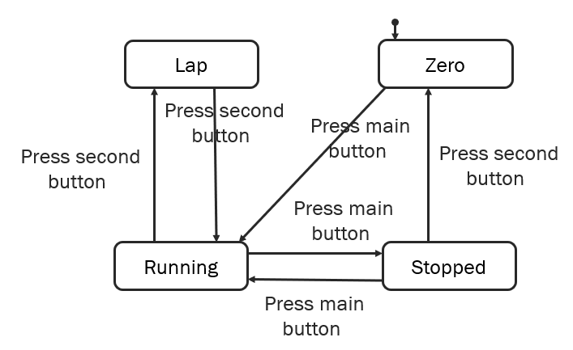

In my [previous post](../fsm-all-stages) I mentioned how finite state machines (FSMs) could be used to generate test cases. From here, they could be hooked up to a test engine to give you automated tests, and voila! You're doing Model Based Testing.

For this post, consider the FSM below:



# Generating test plans

The FSM is represented by a directed graph. By walking the graph, we can explore the different ways a user might move through an application.
At each step, we can assert that we are in the correct state, for example by looking for particular text, or the presence or absence of an element on the page. Then we can take an action, like clicking a button, and assert that we're in the next expected state.

"Walking the graph" is how we generate these test plans.
There are several options for how to walk the graph. Algorithms like Dijkstra's Algorithm allow us to find the shortest path from one state (usually the "initial" state) to any other. This doesn't guarantee that we'll cover every transition in the FSM, but there are others that do. The `@xstate/test` JS library has built in support for `getShortestPathPlans` and `getSimplePathPlans`.

In principle, we need to decide what level of "coverage" we want, and then decide what to do from there.

## Do it yourself

It's trivial (though possibly tedious) to generate test plans yourself. Start with your diagram, and mark each state and transition as you go through. If you just want to hit each

In principle, we start at the beginning (initial state), take one of the available transitions, end up at another state, then take one of _those_ transitions, until we hit a dead end, or "final" state. That completes one test plan. Then we start again, this time taking a different transition if available. Repeat that process until your coverage measure is met, and those are your test plans.

[gif? walkthrough of creating plans]

The above let you generate tests in advance, which could be automated and run later, but it's also perfectly valid to manually test them -- I'll warn you though; complicated models can result in _lots_ of test plans, so you might be there a while.

## Online tests

Another way to execute tests is to run them "online". That's the term used, but really it's making decisions about which transition to take _while you're executing_ the tests. Again, several options for how to do this with their own pros and cons -- weighted transitions, random walk, higher weight for non-visited paths. One important difference between online and offline tests is that online tests might not be repeatable by re-running them, depending on implementation.

## An example using `@xstate/test`

I used XState to generate tests for the FSM above, resulting in 17 generated tests.

```
 PASS  src/__tests__/with-lap.test.ts
  stopwatch with lap
    √ coverage (1 ms)
    reaches state: "zero" ({"resumeCount":0,"unlapCount":0})
      √ via  (1 ms)
    reaches state: "running" ({"resumeCount":0,"unlapCount":0})
      √ via PRESS_MAIN_BUTTON (1 ms)
    reaches state: "stopped" ({"resumeCount":0,"unlapCount":0})
      √ via PRESS_MAIN_BUTTON → PRESS_MAIN_BUTTON
    reaches state: "lap" ({"resumeCount":0,"unlapCount":0})
      √ via PRESS_MAIN_BUTTON → PRESS_SECOND_BUTTON
    reaches state: "running" ({"resumeCount":1,"unlapCount":0})
      √ via PRESS_MAIN_BUTTON → PRESS_MAIN_BUTTON → PRESS_MAIN_BUTTON
    reaches state: "running" ({"resumeCount":0,"unlapCount":1})
      √ via PRESS_MAIN_BUTTON → PRESS_SECOND_BUTTON → PRESS_SECOND_BUTTON (1 ms)
    reaches state: "stopped" ({"resumeCount":1,"unlapCount":0})
      √ via PRESS_MAIN_BUTTON → PRESS_MAIN_BUTTON → PRESS_MAIN_BUTTON → PRESS_MAIN_BUTTON
    reaches state: "lap" ({"resumeCount":1,"unlapCount":0})
      √ via PRESS_MAIN_BUTTON → PRESS_MAIN_BUTTON → PRESS_MAIN_BUTTON → PRESS_SECOND_BUTTON (1 ms)
    reaches state: "stopped" ({"resumeCount":0,"unlapCount":1})
      √ via PRESS_MAIN_BUTTON → PRESS_SECOND_BUTTON → PRESS_SECOND_BUTTON → PRESS_MAIN_BUTTON
    reaches state: "lap" ({"resumeCount":0,"unlapCount":1})
      √ via PRESS_MAIN_BUTTON → PRESS_SECOND_BUTTON → PRESS_SECOND_BUTTON → PRESS_SECOND_BUTTON
    reaches state: "zero" ({"resumeCount":1,"unlapCount":0})
      √ via PRESS_MAIN_BUTTON → PRESS_MAIN_BUTTON → PRESS_MAIN_BUTTON → PRESS_MAIN_BUTTON → PRESS_SECOND_BUTTON
    reaches state: "running" ({"resumeCount":1,"unlapCount":1})
      √ via PRESS_MAIN_BUTTON → PRESS_MAIN_BUTTON → PRESS_MAIN_BUTTON → PRESS_SECOND_BUTTON → PRESS_SECOND_BUTTON
    reaches state: "zero" ({"resumeCount":0,"unlapCount":1})
      √ via PRESS_MAIN_BUTTON → PRESS_SECOND_BUTTON → PRESS_SECOND_BUTTON → PRESS_MAIN_BUTTON → PRESS_SECOND_BUTTON
    reaches state: "stopped" ({"resumeCount":1,"unlapCount":1})
      √ via PRESS_MAIN_BUTTON → PRESS_MAIN_BUTTON → PRESS_MAIN_BUTTON → PRESS_SECOND_BUTTON → PRESS_SECOND_BUTTON → PRESS_MAIN_BUTTON
    reaches state: "lap" ({"resumeCount":1,"unlapCount":1})
      √ via PRESS_MAIN_BUTTON → PRESS_MAIN_BUTTON → PRESS_MAIN_BUTTON → PRESS_SECOND_BUTTON → PRESS_SECOND_BUTTON → PRESS_SECOND_BUTTON (1 ms)
    reaches state: "zero" ({"resumeCount":1,"unlapCount":1})
      √ via PRESS_MAIN_BUTTON → PRESS_MAIN_BUTTON → PRESS_MAIN_BUTTON → PRESS_SECOND_BUTTON → PRESS_SECOND_BUTTON → PRESS_MAIN_BUTTON → PRESS_SECOND_BUTTON

Test Suites: 1 passed, 1 total
Tests:       17 passed, 17 total
```

We'll follow up in more detail in the next post, but to hint at the important bits:

- we use `context` to track how many times we've been through each loop
  - **running -> stopped -> running** and
  - **running -> lap -> running**
- we define stop conditions where we will traverse each loop at most once, through the `filter` option in `getShortestPathPlans`

We could change the conditions to allow it to go through each loop many times if that was important functionality. In reality, there shouldn't be any difference in behaviour for a stopwatch.
End-to-end tests can take a while to execute, and we want to balance confidence with execution time, so for this example we'll only cover that once.

The next post will go through setting up model-based testing using XState in more detail
