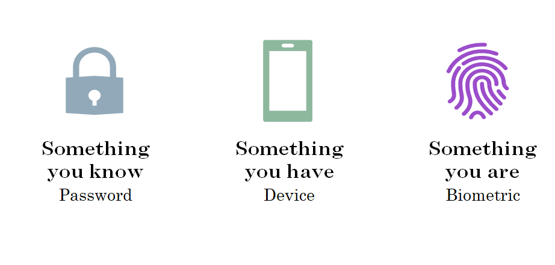
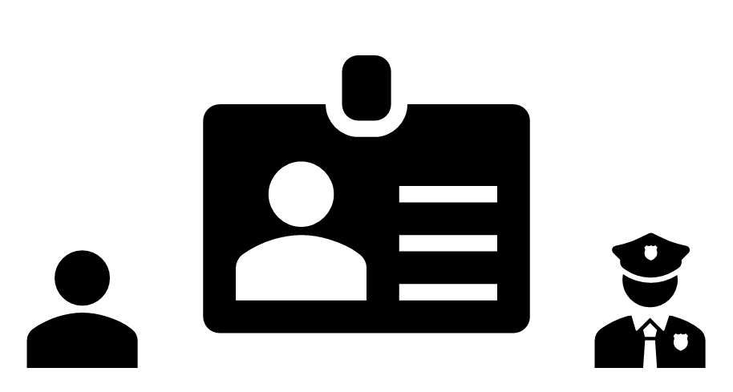
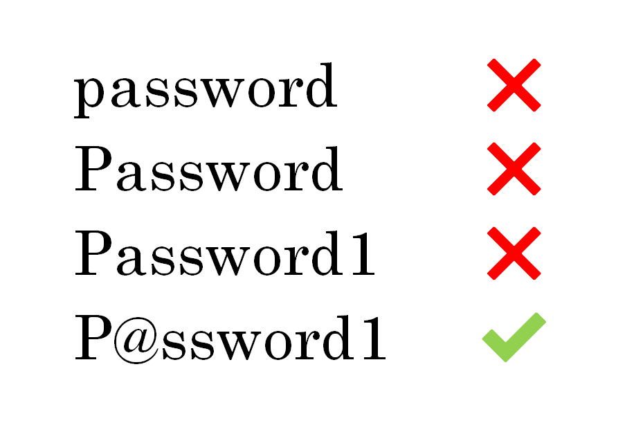
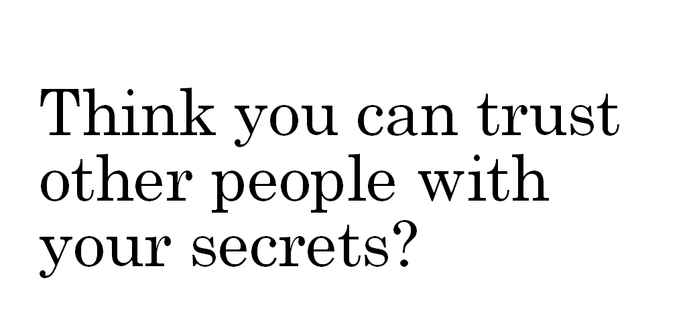
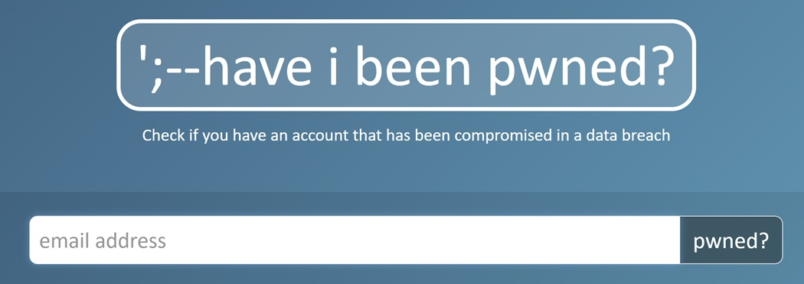

Other posts in this series:

- [Forget your passwords with the Web Authentication API](../part-1-forget-your-passwords)

---

## What is authentication?

Authentication is about proving your identity.
An authentication ceremony allows a user to prove that they are who they say they are.
In order to prove your identity, you will typically use
something you know,
something you have, or
something you are.

In web applications, authentication typically involves logging in to a system,
but authentication happens in real-world situations, too.
Imagine you are trying to get into a nightclub.
After waiting in line, you are asked by a bouncer to present your ID.

This exchange has serves a dual purpose:
firstly, they need to check your date of birth to figure out if you're old enough to enter -- that's _authorization_ --
but more importantly, they need to verify that it's _your_ date of birth they're checking -- _authentication_.

There are a few attributes of the card that allow it to be used as verification of your identity:

1. It's issued by a trusted source, which can be verified by making sure it has the right layout, colours, holograms, etc.
1. The photo looks like you
1. It has your name on it

In practice there are more things the bouncer will consider.
Examples include
whether you're adhering to a dress code,
or if you're on a guest list or have tickets for an event.
In web apps, this might be something like restricting access to certain sections based on your role,
or preventing access to the main functionality of an app if you haven't made a payment.

## What's wrong with passwords?

People typically don't make good passwords.
Some of us might use password managers to help, but it's a small minority.
Even the most conscientious user has a few passwords outside of their password manager,
for example their OS user account, or the master password for their password manager.

Because we know people struggle to make strong passwords,
we add a whole lot of extra rules around them,
like password complexity rules
or forced password changes every 90 days.
These rules can give the appearance of a stronger password,
or less risk when a password is compromised.
Whether that is true depends on how you use them.

Password complexity rules can provide a false sense of security,
since so many of us simply add numbers onto the end or make common substitutions of letters for symbols.
The idea that a complex password is better doesn't hold up when so many passwords follow similar patterns.

A password is intended to be something that is only known by the user,
and can be verified by the service where they use it.
It shouldn't be stored on either side in a way that someone else could decipher it.
For users, that usually means not writing it down in a notebook titled "Passwords",
and for application developers, that means not storing it in plain text.
The password is a shared secret.

If you trust your friends, but you wouldn't give them your bank account password,
you're probably not OK with someone you don't trust getting your passwords.
If your password has been compromised, you may get some warning,
for example a bank may require verification of any unusual activity
(e.g. large transfers to an attacker's bank account).
Other times, we only know when large dumps of passwords end up on the internet, at sites like
<a href="https://haveibeenpwned.com/" target="_blank" rel="noopener">Have I Been Pwned</a>

Even if none of your accounts or passwords have been contained in a published breach,
attackers still have ways to get them from you.
Many people have had their passwords stolen by phishing websites
-- websites that are designed to look like legitimate websites with the hope that you'll enter your login information into them.
Sometimes, they'll find a list of common passwords and try them with a number of accounts.

Ultimately, [your password isn't the problem](https://techcommunity.microsoft.com/t5/Azure-Active-Directory-Identity/Your-Pa-word-doesn-t-matter/ba-p/731984), nor is how they are stored. The biggest problem with passwords is not how we deal with passwords, but that we have them at all.

We'll explore an alternative in the next post in the series.
