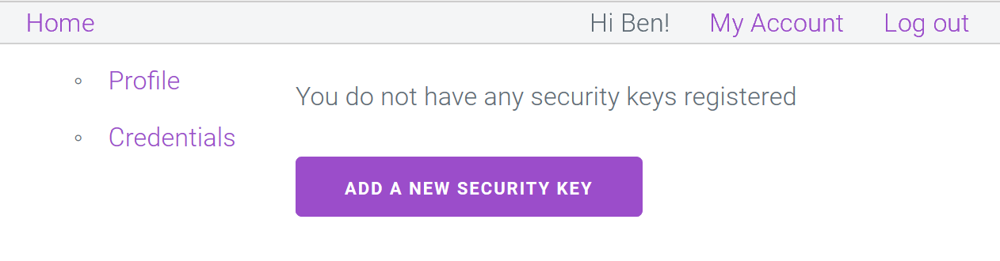
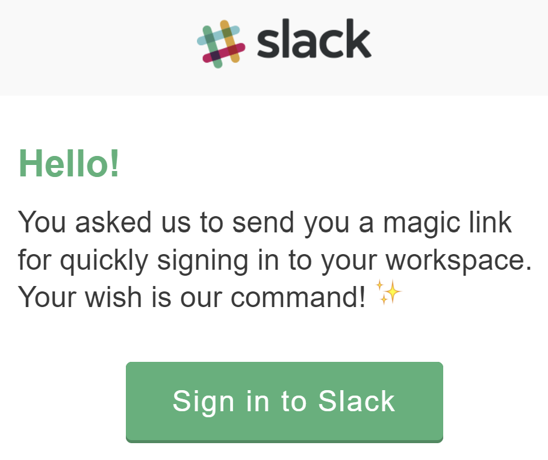

Other posts in this series:

- [Forget your passwords with the Web Authentication API](../part-1-forget-your-passwords)
- [The problem with passwords](../part-2-the-problem-with-passwords)
- [The Web Authentication API](../part-3-web-authentication-api)

---

## How can WebAuthn be better for users?

Allowing a user to create an account without a password means
their account is less likely to be compromised,
and the use of more secure (when compared to SMS),
and easier-to-use 2FA (when compared to one time passcodes).
Those should do the trick!

You can [try it out for yourself](https://webauth.io) if you have an authenticator
(remember: if you're using a phone there's a good chance you're holding one).
If you don't have an authenticator, I've recorded a video showing how easy it is to register and login.

<video width="630" controls>
  <source src="../register-login-demo.mp4" type="video/mp4">
Your browser does not support the video tag.
</video>

 
That all looks good, but there might be a few other things you need to consider.

## How do I enable WebAuthn for my users?

Ultimately, a lot of these decisions are up to you/your company to decide,
but I'll give my thoughts below as well. Here are some things to think about:

🚧👷‍♀️ Still working on this bit 👷‍♂️🚧

### Registration

- Passwordless login or second factor?
- Is a password still required?
- Is a password still _allowed_?
- Register the token now or later?

### How do you make the feature discoverable?

How do you get more people using it?
• Hints on the login page?
• Prompt after logging in with password? 
• What kind of messages do you want?
• How forcefully will you push?

### Login

- Passwordless? Do you have a different login page entirely or a separate form?
- Usernameless? More conditions to meet, but it’s an option
- Fall back to using a password?

### Account management

Manage devices:

- Nicknames
- Last used
- Prompt to (or automatically) remove "old" authentication methods

### Account recovery

- Password or no?
- Magic link 
- Store their email. VERIFY

### What have the big companies done/who can I copy?

- Twitter -- single key
- Microsoft -- many keys
- Facebook -- many keys
- Google -- many keys
- GitHub -- single key?
